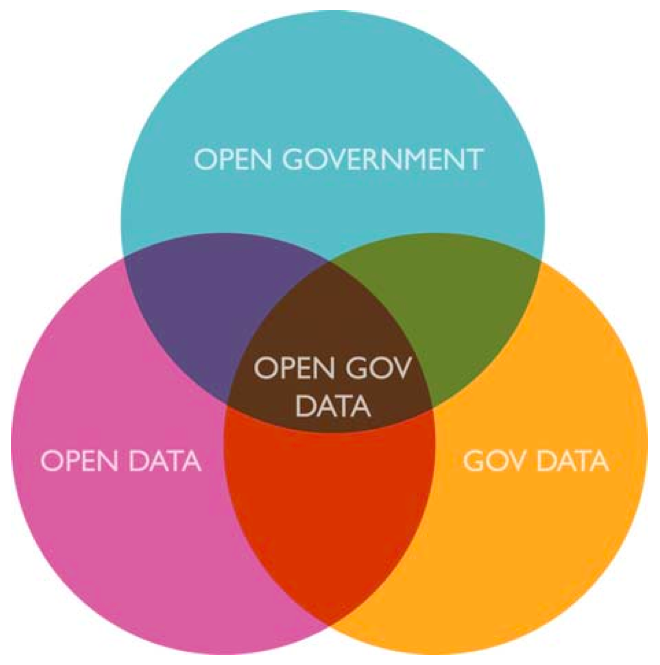
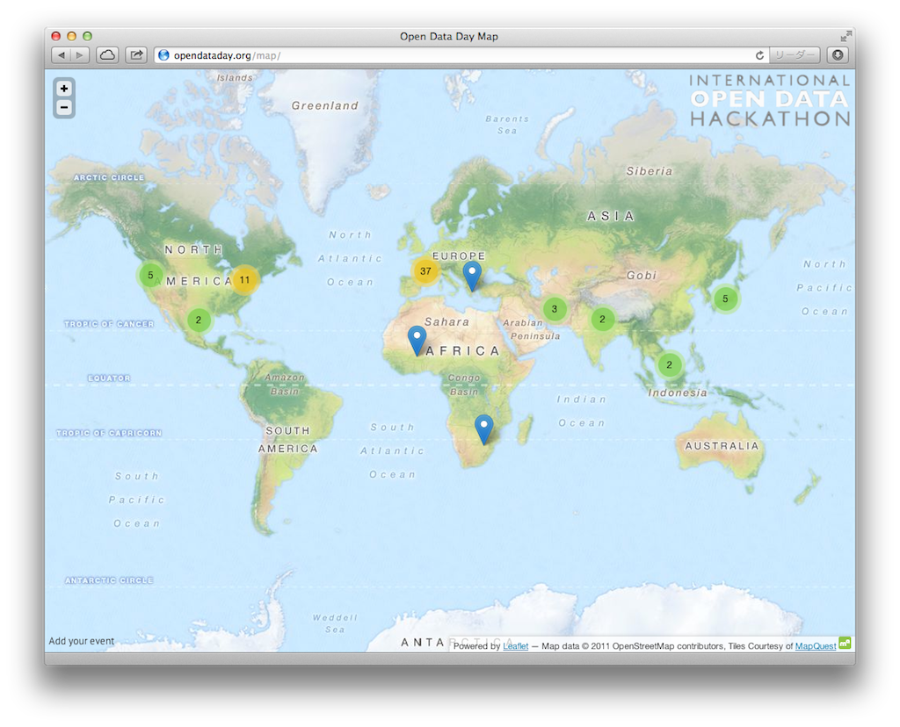
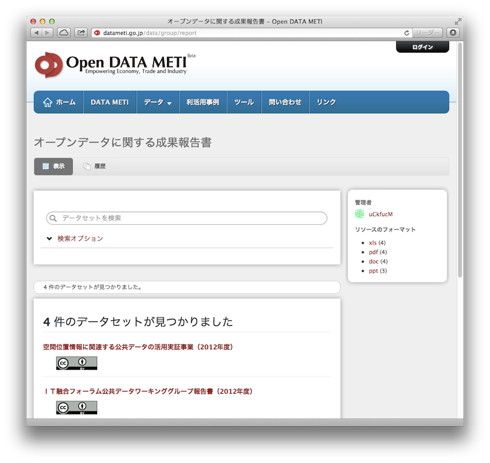
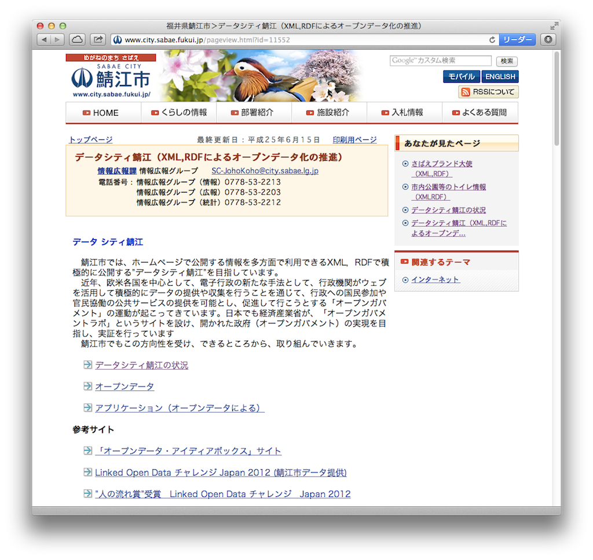
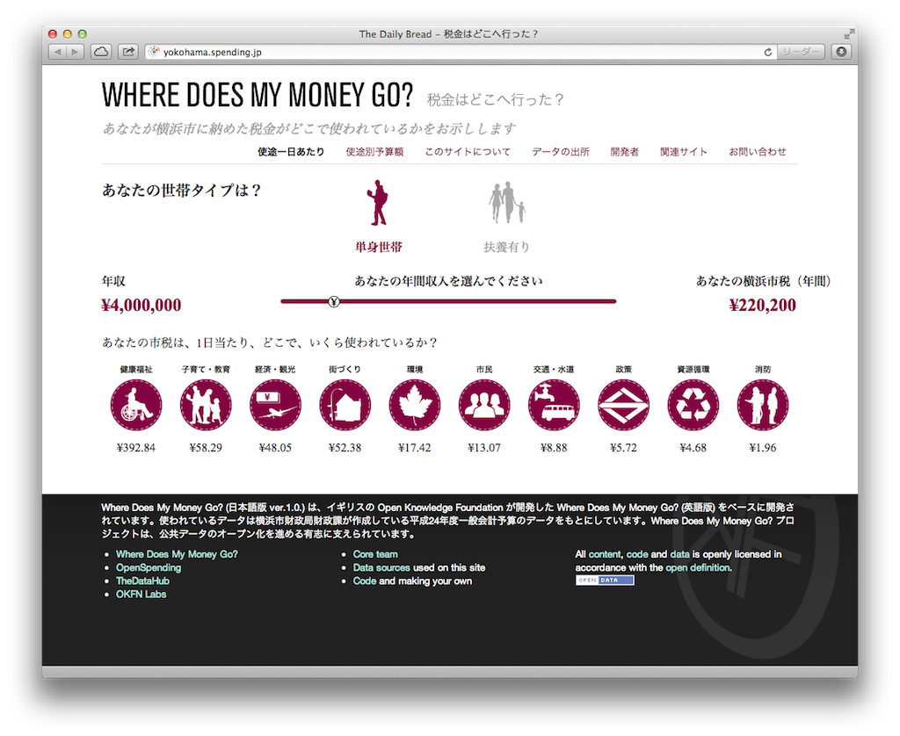

> このファイルは著者による非公式版です。学術論文等へ引用される場合には、正式版の論文（「情報管理」2013年10月号掲載）を必ずご参照ください。（大向一輝. 日本におけるオープンデータの進展と展望. 情報管理. 2013, vol. 56, no. 7, p. 440-447.）

# 抄録 #

政府・地方自治体・公的機関による情報公開の取り組みの一環として「オープンデータ」が注目を集めている。欧米の動きと比較すると、日本におけるオープンデータの普及が遅れていることは確かであるが、行政機関や市民の努力によって、急速にデータの質・量ともに充実が進んでいる。本稿では国内における先進例を紹介し、今後の展望について議論する。

# はじめに #

政府・地方自治体・公的機関による情報公開の取り組みの一環として「オープンデータ」が注目を集めている。オープンデータとは、組織や個人が持つデータをインターネットを通じて広く公開し、第三者に利活用の機会を供することを指す。

近年、情報技術を積極的に活用することで行政機関の透明度を高め、市民の参加や協働を活性化させるオープンガバメント運動が盛んになっており、公共セクターによるオープンデータの活動はその延長線上に位置づけられる。その意味で、民間企業や非営利団体が提供するオープンデータと区別してオープンガバメントデータと呼ばれることもある（図1）。本稿では、主に日本の公共セクターの取り組みについて述べるが、原則としてオープンデータと表記する。

既存の情報公開制度との大きな違いは、市民の請求に応じて供するのではなくあらかじめWebサイトなどで公開がなされること、またコンピューターでの処理に適した形式で提供されること、営利・非営利を問わず利用できることが挙げられる。これらの原則のもとにさまざまな調査・統計など行政機関が持つ大量のデータが公開されることで、オープンガバメントの実現、民間との協働による行政サービスの向上、イノベーション・新産業創出などが期待される。

すでに海外では多数の実践例があり、政府レベルでは米国のdata.gov、英国のdata.gov.ukを筆頭にオープンデータを一元的に集約したWebサイトが各国で構築されている。

2013年6月に英国で開催されたG8サミットではオープンデータ憲章が採択され、すべての参加国が年内に行動計画を策定するとともに、年1回の進捗報告を行うことが決定された。

* オープンデータ憲章（概要） <http://www.mofa.go.jp/mofaj/gaiko/page23_000044.html>

政府のオープンデータの取り組みに関する国際評価も行われている。World Wide Web Foundationが2012年9月に公表したOpen Data Indexでは14の評価項目を用いており、日本は上位20か国中19位となっている。また、Open Knowledge FoundationによるG8諸国を対象としたOpen Data Censusでは3位だが、10項目のうち突出した点がないという評価であった。

* Open Data Index <http://www.webfoundation.org/2012/09/introducing-the-open-data-index/>
* Open Data Census <http://census.okfn.org/g8/>

都市・地方自治体におけるオープンデータの活動は枚挙に暇がない。象徴的な事例として、2013年2月23日のInternational Open Data Dayは、各都市の有志がオープンデータを利用したアプリケーション開発や議論を行うワークショップを同時多発的に開催するもので、最終的に40か国・102都市が参加する大規模なイベントとなった（図2）。

* International Open Data HACKATHON <http://opendataday.org>

欧米の動きと比較すると、日本におけるオープンデータの普及が遅れていることは確かであるが、行政機関や市民の努力によって、急速にデータの質・量ともに充実が進んでいる。本稿では国内における先進例を紹介し、今後の展望について議論したい。

# 政府におけるオープンデータ #

2012年7月の電子行政オープンデータ戦略によって、日本政府としてオープンデータに取り組む姿勢が明確化された。政権交代を経てもその方針は継続され、2013年6月には世界最先端IT国家創造宣言の中でオープンデータの推進が重要課題として挙げられている。これらを受けて、各省庁での検討が進められ、具体的な活動や成果に結実しつつある。以下では代表的な動きについて述べる。

* 電子行政オープンデータ戦略 <http://www.kantei.go.jp/jp/singi/it2/pdf/120704_siryou2.pdf>
* 世界最先端IT国家創造宣言 <http://www.kantei.go.jp/jp/singi/it2/kettei/pdf/20130614/siryou1.pdf>

2012年7月に、総務省を中心として産官学が連携する「オープンデータ流通推進コンソーシアム」が設立された。技術委員会、データガバナンス委員会、利活用・普及委員会の3委員会が設けられ、総務省が実施したオープンデータの実証実験に基づく統一的なデータフォーマットの検討やライセンスに関する議論が行われた。筆者が所属する利活用・普及委員会では、各種事例の共有のほか、国内の先進的な事例を独自に選定する「勝手表彰」などの新しい試みがなされた。

総務省独自の取り組みとしては、情報通信白書のオープン化を挙げることができる。白書には著作性のあるテキスト文書、事実情報である統計データなど由来の異なる情報が多数含まれているが、第三者が著作権を有する情報を除いて原則的に2次利用を許可し、これを明示するためにクリエイティブ・コモンズライセンスを付与している。

* オープンデータ流通推進コンソーシアム <http://www.opendata.gr.jp>
* 情報通信白書 <http://www.soumu.go.jp/johotsusintokei/whitepaper/>

経済産業省では、2012年8月にIT融合フォーラム／公共データワーキンググループが立ち上がり、省内で保有するデータをオープン化するために必要な技術的課題、ライセンス、ワークフローなどについて幅広く議論が行われた。

その成果として、経済産業省の持つデータを一元的に集約し、検索・利用できるデータカタログ「Open DATA METI（β版）」が公開された（図3）。このサイトに掲載されたデータ（統計データや白書、報告書など）にはクリエイティブ・コモンズライセンスが付与されており、自由に利用することが可能である。

また、各種データの項目名を政府内で統一することを目的として、共通語彙基盤と呼ばれる用語辞書の開発を行っている。

* IT融合フォーラム公共データワーキンググループ <http://www.meti.go.jp/committee/kenkyukai/shoujo/it_yugo_forum_data_wg/summary.html>
* Open DATA METI <http://datameti.go.jp>
* 共通語彙基盤 <http://datameti.go.jp/data/dataset/report-002-2012>

内閣官房では、電子行政オープンデータ戦略に基づき、実務者会議およびその傘下のデータワーキンググループ、ルール・普及ワーキンググループを開催し、全省庁を対象としたオープンデータ化のロードマップの策定や、新たにデータを作る際に必要な知識をまとめたガイドラインの作成を行っている。

現在は2013年度中に予定されている日本政府版データカタログの試行版公開を目標として、各省庁が保有するデータの把握と登録作業が進められている。

* 電子行政オープンデータ実務者会議 <http://www.kantei.go.jp/jp/singi/it2/densi/>

これらの活動のほか、独立行政法人統計センターでは政府統計のポータルであるe-Statの機能を拡張し、API形式で情報を入手することができる次世代統計利用システムの提供や、国土地理院によって基盤地図情報の再利用・再配布を認める柔軟な利用規約が試作されるなど、オープンデータ化に向けた施策が数多く見られる。

* 次世代統計利用システム <http://statdb.nstac.go.jp>
* 基盤地図情報 <http://www.gsi.go.jp/kiban/index.html>

# 地方自治体におけるオープンデータ #

## 福井県鯖江市 ##

地方自治体によるオープンデータの取り組みは、政府よりも早い時期から行われている。もっとも先進的な取り組みを行っている福井県鯖江市は、2012年1月に公開された市内のトイレ情報を皮切りに、避難所などの施設情報、観光・イベント情報や人口統計といった多様なデータを提供している（図4）。特に「データシティ鯖江」のコンセプトに基づき、周辺の企業やコミュニティーと密接に連携し、データを活用したアプリケーションの開発やワークショップの開催を積極的に進めるなど、オープンデータを地域振興の重要な柱として位置づけている点が特徴的である。現在では、静的な情報だけではなく、コミュニティバスのリアルタイム運行情報といった、海外でも例のないデータ提供が行われている。また、近隣の自治体や県に対してノウハウを共有し、オープンデータの活性化に努めている。

* データシティ鯖江 <http://www.city.sabae.fukui.jp/pageview.html?id=11552>

## 千葉県流山市 ##

千葉県流山市では、市役所が30種類を超えるデータを公開しているだけでなく、市議会側もオープンデータの趣旨に賛同し、議会での審議結果を公開している。

* 流山市オープンデータトライアル <http://www.city.nagareyama.chiba.jp/10763/index.html>
* 流山市議会オープンデータトライアル <http://www.nagareyamagikai.jp/opendata/>

## 埼玉県南埼玉郡宮代町 ##

埼玉県南埼玉郡宮代町では、Webサイトで予算・決算の細目や調達情報の詳細を閲覧できるようになっている。予算・決算情報については住民1人あたりの税金支出を算出するなど、透明性の高い運営が行われている。

* 宮代町Webサイト「電脳みやしろ」 <http://www.town.miyashiro.saitama.jp>

## 神奈川県横浜市 ##

中小規模の自治体では首長の意向によってオープンデータが進められる傾向が強い一方で、大規模自治体では外郭団体や地域のコミュニティーが先導する例が多い。神奈川県横浜市では、2010年より横浜市芸術文化振興財団が市内のアート関連情報のオープン化を行っている。この試みが一定の評価を得たことが契機となり、市民の側からオープンデータを推進することを目的とした横浜オープンデータソリューション発展委員会が発足し、啓発イベントや行政機関への提言を行っている。また国内の自治体レベルでは初めてとなるデータカタログを公開している。

* ヨコハマ・アート・LOD <http://fp.yafjp.org/yokohama_art_lod>
* 横浜オープンデータソリューション発展委員会 <https://www.facebook.com/yokohamaopendata>
* 横浜オープンデータポータル <http://data.yokohamaopendata.jp>

## その他 ##

その他にも、千葉市・福岡市・奈良市・武雄市の4市によるビッグデータ・オープンデータ活用推進協議会の設立や、首都圏の九都県市首脳会議におけるオープンデータ推進のための協議など、多くの活動が同時多発的に行われている。

* ビッグデータ・オープンデータ活用推進協議会 <https://www.facebook.com/bigdataopendata4city>
* 九都県市首脳会議 <http://www.9tokenshi-syunoukaigi.jp>

# 市民の参加と協働 #

「はじめに」で述べたように、オープンデータは単なる行政機関の情報公開ではなく、市民の参加と協働を促すものでなければならない。その意味で、市民が自らデータを作成・公開する役割を担うような枠組みが注目を集めている。

## WHERE DOES MY MONEY GO? ##

「WHERE DOES MY MONEY GO?：税金はどこへ行った？」（図5）は、自治体がどのような分野に予算を投入しているかを可視化するために、市民が予算データを収集・登録するプロジェクトとして英国で始まった。日本では2012年7月に横浜市版が立ち上がった後、急速に他の自治体に広がり、現在では30サイトを超える。自治体ごとに予算項目が異なるために比較が難しいこと、また基になるデータが紙媒体でしか得られないために手作業での入力を余儀なくされる自治体が多いなど、オープンデータ自体の課題を浮き彫りにしながらも、多くの市民に支持される活動に育っている。

* WHERE DOES MY MONEY GO? <http://spending.jp>

## Wikipediaタウンをつくろう ##

行政にかかわるデータだけでなく、地域の観光情報を市民が作る試みもある。前述の横浜オープンデータソリューション発展委員会では、International Open Data Dayの企画として、グループで名所旧跡を探訪し、その後図書館などで詳細な情報を調べながら見聞きした内容をウィキペディアに書き込むワークショップを開催した。

* Wikipediaタウンをつくろう <http://www.solabo.net/wikipedia0223/>

## LODチャレンジ ##

オープンデータを活用したアプリケーション開発を活性化させるために、コンテスト形式のイベントが多数行われている。中でも最大の規模を誇るLinked Open Data（LOD）チャレンジは、アプリケーションだけでなく、アイデアやデータセットそのものを募集対象とすることで、参加のハードルを下げるとともに、データ作成の重要性を伝えている。第1回（2011年度）は73件、第2回（2012年度）は205件の応募があり、オープンデータに対する関心が急速に高まっていることがわかる。LODチャレンジは2013年度も引き続き開催される。

* LOD Challenge 2013 <http://lod.sfc.keio.ac.jp>

## その他 ##

他にも、地理空間情報を中心としたアーバンデータチャレンジ東京や、ビッグデータ・オープンデータ活用推進協議会のアイデアコンテストなど、大規模なコンテストが複数行われる予定である。

* アーバンデータチャレンジ東京 <http://aigid.jp/GIS/udct/2013/index.html>

市民のオープンデータ活動を支えるコミュニティーも整備されつつある。オープン・ナレッジ・ファウンデーション・ジャパン（Open Knowledge Foundation Japan: OKFJ）は海外の最新動向の調査やイベントの開催を精力的に行っている。筆者が参加するリンクト・オープン・データ・イニシアティブ（Linked Open Data Initiative: LODI）は主に技術面での支援を目的として設立された。

* オープン・ナレッジ・ファウンデーション・ジャパン <http://okfn.jp>
* リンクト・オープン・データ・イニシアティブ <http://linkedopendata.jp>

# 課題と展望 #

ここまで、日本の公共セクターのオープンデータの潮流についてさまざまなレベルの取り組みを紹介してきた。先駆者たちの努力によって、ライセンスの設定など、公開のための方法論に一定の方向性が見えてきた。

その一方で、情報を表現するための共通フォーマットがなく、現状では個々の機関が自由な形式でデータを公開しているに過ぎない。組織を超えた俯瞰的な分析や相互比較を行うためにはデータの加工が必要である。

このような課題に対して、Webの提案者であるTim Berners-Leeはオープンデータ公開のための5つのステップを提示している（図6）。最初の段階ではオープンライセンスに基づく公開がなされることが求められており（1つ星）、次にコンピューターによる利活用が容易な形式であること（2つ星）、非独占的なフォーマットであること（3つ星）が求められる。さらには識別子としてURIを使用すること（4つ星）、URIを用いて他のデータへリンクすること（5つ星）が満たされればデータ間の相互運用性が高まる。

後半の4つ星、5つ星を達成するためにはセマンティックWebやLODの知識が必要であり、政府や地方自治体の担当者が実施するのは困難であるとの批判もある。しかしながら、これらの課題は必ずしもデータ提供者のみが解決する必要はなく、形式を整えて分析を代行するといったビジネスやコミュニティーが生まれ得るのもオープンデータの利点であると言える。

今後、オープンデータに携わる機関はさらに増加するものと思われる。公開だけを目的とするのではなく、オープンガバメントの理想である行政機関と市民との協働が達成されることを願ってやまない。

> このファイルは著者による非公式版です。学術論文等へ引用される場合には、正式版の論文（「情報管理」2013年10月号掲載）を必ずご参照ください。（大向一輝. 日本におけるオープンデータの進展と展望. 情報管理. 2013, vol. 56, no. 7, p. 440-447.）
> 